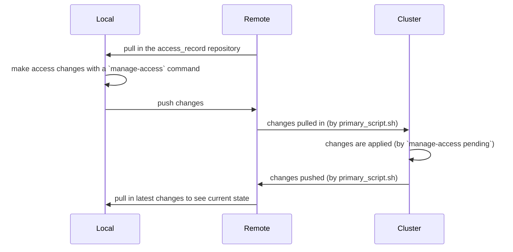

It may be useful to regularly run some commands:

- `manage-access check` to keep access up-to-date within each location as their contents might change.
- `manage-access pending` to apply access to users that didn't exist within the initial system.

If access is being managed across systems, it may also be useful to automatically pull in the access management project, and push it as access is updated.

These tasks could be brought together in a script:

```sh
#!/bin/bash

cd /path/to/access_record
git pull

manage-access pending --push
manage-access check
```

This script could also be used to keep this tool up to date:

```sh
pip uninstall -y file_access_manager
pip install https://github.com/DISSC-yale/file_access_manager/archive/main.tar.gz
```

This script could then be run automatically with a cron job (e.g., to be run every 30 minutes):

```sh
*/30 * * * * source script_name.sh
```

## Slurm

If access is being managed on a cluster using Slurm, you might add an initial module load to the script:

```sh
# depending on what an appropriate module would be in your system
module load python/3.10
```

And a [scron job](https://docs.ycrc.yale.edu/clusters-at-yale/job-scheduling/scrontab/) could run the script using the same syntax.

## Mixed Ownership

Access Control Lists can only be applied or changed on files you own, so in cases where a directory contains files owned by different people,
every owner would need to run `manage-access check`. This will attempt to apply access to everything, but will continue through failure to
catch any owned files.

In this case, it might be useful to have a secondary script that only applies access (i.e., does not change any of the access_record files):

```sh
#!/bin/bash

cd /path/to/access_record

manage-access pending --no-pull --no-update
manage-access check --no-pull
```

## Complete Example

This is an example of starting and managing an automated access management project.

### Initialize

Say a set of files lives on cluster storage at `/data/setname`.

We might start an access management project at `/data/admin`, with a location pointing to the controlled directory:

```sh
cd /data
manage-access init admin
manage-access locations setname /data/setname
```

Then upload to a remote repository (e.g., dissc-yale/access_record):

```sh
git remote add origin git@github.com:dissc-yale/access_record.git
git branch -M main
git push --set-upstream origin main
```

### Add Scripts

`/data/admin/primary_script.sh`:

```sh
#!/bin/bash

module load python/3.10

cd /data/admin
git pull

pip uninstall -y file_access_manager
pip install https://github.com/DISSC-yale/file_access_manager/archive/main.tar.gz

manage-access pending --push
manage-access check
```

`/data/admin/secondary_script.sh`:

```sh
#!/bin/bash

module load python/3.10

cd /data/admin

manage-access pending --no-pull --no-update
manage-access check --no-pull
```

Make sure to commit and push these after adding them.

Then establish a cron job (e.g., with `crontab -e` or `scrontab -e`):

```sh
# this also adds a log output to the management repository
#SCRON -o /data/admin/logs/primary_job-%j.out
*/30 * * * * source /data/admin/primary_script.sh
```

### Management

Now new access changes can be made anywhere and pushed to the management repo, which will then be pulled in by `primary_script.sh`, applied, and updated:


